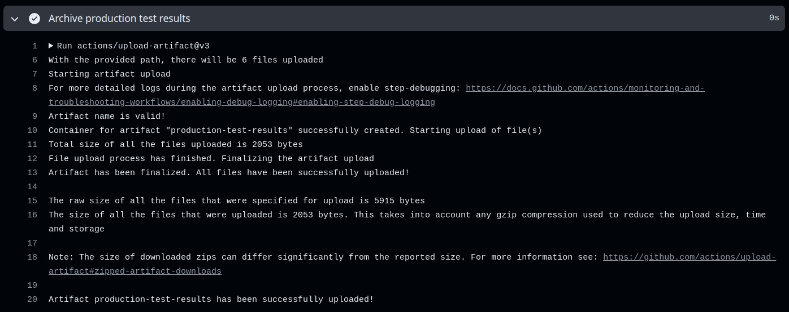

# Continuous Deployment - Deploy Buddy

## a) Metodologia de Deployment

A abordagem Blue/Green Deployment envolve a manutenção de duas versões do ambiente de produção - Blue (a versão atual em produção) e Green (a nova versão a ser implantada). O tráfego de usuários inicialmente flui para o ambiente Blue. Quando uma nova versão do software está pronta, ela é implantada no ambiente Green. Após a verificação e testes no ambiente Green, o tráfego é redirecionado do ambiente Blue para o Green. Se qualquer problema for encontrado, o tráfego pode ser rapidamente redirecionado de volta para o ambiente Blue.

**Funcionamento Baseado na Stack CloudFormation:**

1. **Definição de Parâmetros:**
   - A stack define parâmetros para o tipo de ambiente, AMI, chave SSH, credenciais AWS, entre outros.

2. **Mapeamento do Tipo de Instância:**
   - Mapeia o tipo de instância EC2 a ser utilizado conforme o tipo de ambiente (dev, uat, prod).

3. **Recursos de VPC e Sub-redes:**
   - Cria uma VPC com sub-redes públicas e um Internet Gateway, configurando tabelas de roteamento para permitir a comunicação com a internet.

4. **Instâncias EC2:**
   - Cria duas instâncias EC2 em diferentes zonas de disponibilidade, configuradas para iniciar o Docker e executar scripts que configuram e executam containers Docker com base nas imagens armazenadas no Amazon ECR.

5. **Grupo de Segurança:**
   - Configura grupos de segurança para controlar o tráfego de entrada e saída das instâncias EC2 e do Load Balancer.

6. **Balanceador de Carga (Load Balancer):**
   - Implanta um Load Balancer para distribuir o tráfego entre as instâncias EC2.

7. **Banco de Dados RDS:**
   - Implanta uma instância de banco de dados RDS PostgreSQL, incluindo grupos de sub-rede e grupos de segurança para o RDS.

**Por que foi selecionada:**

A metodologia Blue/Green Deployment foi selecionada para este projeto devido à sua capacidade de minimizar o tempo de inatividade e permitir uma reversão rápida em caso de problemas. Isso é crucial para manter a alta disponibilidade e a confiança dos usuários no sistema. Além disso, ela proporciona um ambiente isolado para testes rigorosos antes de qualquer alteração ser visível para os usuários finais, garantindo a qualidade e a estabilidade das novas versões implantadas.

## b) Descrição das Tecnologias Utilizadas para o Continuous Deployment

Neste projeto, utilizamos um conjunto integrado de tecnologias para garantir um processo de Continuous Deployment eficaz, seguro e replicável. Cada componente foi escolhido por sua robustez, integração com a AWS e suporte à automação completa do ciclo de vida de deployment.

### **GitHub Actions**
O GitHub Actions permite a automação completa do nosso pipeline de CI/CD. Configuramos várias workflows que são disparadas por eventos específicos no repositório, como push, pull request ou manualmente via workflow_dispatch, garantindo que cada atualização no código seja automaticamente testada, construída e implantada.

### **AWS CloudFormation**
Utilizamos o AWS CloudFormation para declarar e provisionar nossa infraestrutura como código. Isso permite uma replicação precisa dos ambientes de desenvolvimento, teste e produção, além de facilitar a gestão de recursos e a automação de rollbacks quando necessário.

### **Docker e Amazon ECR**
Os containers Docker encapsulam nosso ambiente de aplicação, garantindo consistência entre os diferentes estágios de deployment. O Amazon ECR serve como repositório para essas imagens, permitindo versionamento seguro e eficiente, além de integração direta com as instâncias EC2 durante o deployment.

### **Amazon EC2 e RDS**
As instâncias EC2 hospedam nossos containers Docker em um ambiente escalável e controlado, enquanto o Amazon RDS fornece serviços de banco de dados robustos com PostgreSQL, otimizando desempenho e confiabilidade.

## c) Prints com Evidências de Cada Etapa do Processo de CD em Funcionamento

Esta seção ilustra visualmente cada etapa do nosso pipeline de Continuous Deployment, demonstrando a integridade e eficácia do processo.

1. **Set up job e Checkout Repo**
   
   - Descrição: Captura inicial do setup do job e do checkout do repositório, mostrando a preparação do ambiente para o deploy.

2. **Configure AWS credentials e Deploy to AWS CloudFormation**
   
   - Descrição: Configuração das credenciais da AWS seguida pelo processo de deployment usando o CloudFormation, onde a infraestrutura é provisionada e configurada automaticamente.

3. **Get EC2 Instance IP e Set up SSH Connection**
   
   - Descrição: Demonstração de como o IP da instância EC2 é recuperado e como a conexão SSH é estabelecida para comunicação segura.

4. **Access EC2 Instance and Execute Script**
   
   - Descrição: Detalhes do acesso à instância EC2 e da execução do script de setup, crucial para preparar o ambiente de execução da aplicação.

5. **Post Configuration Cleanup**
   
   - Descrição: Passos finais mostrando a limpeza e finalização do job, garantindo que nenhum processo ou configuração residual permaneça.


# Continuous Deployment - Salesforce

A pipeline de Continuous Deployment (CD) para Salesforce é uma peça essencial para garantir que as mudanças no código sejam devidamente testadas e implantadas no ambiente de produção de forma automatizada e segura. Esta seção irá detalhar cada aspecto dessa pipeline, destacando sua configuração, implementação e operação.

## a) Metodologia de Deployment

A metodologia de deployment adotada para a pipeline de Continuous Deployment (CD) do Salesforce segue práticas rigorosas de DevOps, garantindo que cada mudança no código seja testada e implantada de maneira segura e eficiente.

1. **Gatilhos do Actions:**: A pipeline é configurada para ser acionada em diversos eventos de pull request na branch `prod`
   - **Abertura de Pull Request**
   - **Sincronização de Pull Request**
   - **Reabertura de Pull Request**
   - **Fechamento de Pull Request**
   - **Submissão de Revisão de Pull Request**
   - **Ação Manual (workflow_dispatch)**

Esses gatilhos garantem que o código seja constantemente integrado e testado, mantendo a qualidade e integridade do código em todas as etapas do desenvolvimento.

2. **Verificação de Pré-Deploy:**: Antes de iniciar o processo de deployment propriamente dito, a pipeline executa um conjunto de testes rigorosos para garantir que o código está em conformidade com os padrões exigidos. Este passo é crucial para evitar a introdução de erros no ambiente de produção.
   - **Testes Apex**: São executados todos os testes Apex no código que está sendo integrado. Apenas se todos os testes passarem, o código é considerado apto para deployment.

3. **Autenticação Segura:**: A autenticação com a org do Salesforce é realizada utilizando a técnica de autenticação JWT (JSON Web Token). Este método garante que a autenticação seja segura, eliminando a necessidade de credenciais expostas e minimizando o risco de acessos não autorizados.
   - **Criação do Arquivo de Chave JWT**: A chave JWT é gerada a partir de segredos armazenados no GitHub Secrets.
   - **Autenticação JWT**: Utilizamos o comando `sfdx auth:jwt:grant` para autenticação na org do Salesforce, utilizando a chave JWT criada.

4. **Deployment Automatizado:**: Após a autenticação bem-sucedida, o código é implantado no ambiente de produção utilizando comandos da Salesforce CLI. Este processo é totalmente automatizado, garantindo que todas as mudanças aprovadas sejam implementadas sem intervenção manual.
   - **Deploy para Produção**: O comando `sf project deploy start` é usado para iniciar o deploy do código no ambiente de produção.

5. **Testes Pós-Deploy:**: Para assegurar que o deployment não introduziu novos problemas no ambiente de produção, são executados testes Apex adicionais após o deploy. Este passo é vital para confirmar que todas as funcionalidades estão operando conforme o esperado.
   - **Execução de Testes Pós-Deploy**: Novamente, o comando `sf apex run test` é utilizado para executar testes Apex no ambiente de produção.

6. **Arquivamento de Resultados:**: Os resultados dos testes pós-deploy são armazenados e arquivados utilizando GitHub Actions. Isto permite uma análise detalhada e retrospectiva, facilitando a identificação de qualquer problema que possa surgir após a implantação.
   - **Arquivamento dos Resultados dos Testes**: A ação `actions/upload-artifact@v3` é usada para arquivar os resultados dos testes, disponibilizando-os para revisão e auditoria.

**Por que foi selecionada:**
Essa metodologia assegura que o processo de deployment seja executado de forma eficiente e segura, mantendo a qualidade e a estabilidade do ambiente de produção do Salesforce.

- **Segurança**: Uso de JWT para autenticação minimiza riscos de segurança.
- **Automação Completa**: Redução de erros humanos e aumento da eficiência através de automação.
- **Qualidade Assegurada**: Testes rigorosos antes e após o deploy garantem que apenas código de alta qualidade chega à produção.
- **Transparência e Auditabilidade**: Arquivamento de resultados de testes permite uma fácil revisão e auditoria do processo de deployment.

## b) Descrição das Tecnologias Utilizadas para o Continuous Deployment

A pipeline de Continuous Deployment (CD) do Salesforce integra uma série de tecnologias e ferramentas que, em conjunto, garantem a eficiência e a segurança do processo de implantação. Abaixo, detalhamos as principais tecnologias utilizadas e suas respectivas funções:

### **GitHub Actions**
A plataforma de automação de CI/CD integrada ao GitHub. Ela permite a criação de workflows personalizados que automatizam processos de desenvolvimento, como build, test e deploy. 

- **Ação de Checkout**: `actions/checkout@v4` é utilizada para clonar o repositório dentro do ambiente de execução da pipeline, garantindo acesso ao código fonte necessário para os próximos passos.
- **Ação de Upload de Artefatos**: `actions/upload-artifact@v3` é empregada para arquivar e compartilhar artefatos, como resultados de testes, entre diferentes jobs da pipeline.

### **Salesforce CLI**
Ferramenta de linha de comando para desenvolver e gerenciar os aplicativos Salesforce. Ela facilita o desenvolvimento, teste e implantação de aplicações dentro da plataforma Salesforce.

- **Instalação via npm**: A CLI do Salesforce é instalada globalmente através do npm (`npm install --global @salesforce/cli`), tornando seus comandos disponíveis para execução nos jobs da pipeline.
- **Autenticação e Deploy**: Comandos como `sfdx auth:jwt:grant` e `sf project deploy start` são utilizados para autenticação segura e deploy de código para a org do Salesforce.

### **Apex**
**Apex** é a linguagem de programação fortemente tipada, orientada a objetos, usada pelos desenvolvedores da Salesforce para executar o fluxo de trabalho e o controle de transações em conjunto com o servidor do Salesforce.

- **Execução de Testes Apex**: Comandos como `sf apex run test` são usados para executar testes Apex, verificando a integridade e funcionalidade do código no ambiente Salesforce.

---------------------------------------------

## c) Fluxo Detalhado de Deploy

1. **Ações Iniciais:**
    - A pipeline inicia clonando o repositório e instalando as ferramentas necessárias, garantindo um ambiente preparado para as operações subsequentes.
    - A criação do arquivo de chave JWT e a autenticação segura no Salesforce são passos críticos para garantir que apenas usuários autorizados possam realizar o deploy.

2. **Deploy Automatizado:**
    - Com a autenticação configurada, o comando `sf project deploy start` inicia o processo de deploy, que transfere as mudanças do código para o ambiente de produção. Esse comando assegura que todas as modificações estejam corretamente aplicadas e disponíveis para os usuários finais.

3. **Validação Pós-Deploy:**
    - Os testes Apex pós-deploy são cruciais para verificar se a nova versão do código funciona conforme esperado no ambiente de produção. Qualquer falha identificada pode ser rapidamente abordada, minimizando o impacto nos usuários.
    - A arquivação dos resultados dos testes permite uma revisão detalhada e documentação das operações de deploy, facilitando auditorias e melhorias futuras.


### Ações Iniciais

A pipeline é acionada em eventos relacionados a pull requests na branch `prod`, incluindo a abertura, sincronização, reabertura e fechamento, além da submissão de revisões de pull request. Também pode ser acionada manualmente usando o evento `workflow_dispatch`.

```yaml
name: CI/CD Pipeline

on:
  pull_request:
    branches:
      - prod
    types:
      - opened
      - synchronize
      - reopened
      - closed
  pull_request_review:
    types: [submitted]
  workflow_dispatch:
```

### Deploy Automatizado e Validação Pós-Deploy

O job `deploy-production` é executado apenas após a conclusão bem-sucedida do job de testes Apex (`test-apex`). Isso garante que somente o código que passou nos testes seja implantado na produção. Abaixo estão os detalhes dos passos implementados nesse job:

1. **Clonagem do Repositório**
    - Descrição: Usa a ação `actions/checkout@v4` para clonar o repositório.

    ```yaml
    - uses: actions/checkout@v4  
    ```


2. **Instalação da CLI do Salesforce**
    - Descrição: Instala a CLI do Salesforce globalmente via npm para permitir a execução dos comandos necessários.

    ```yaml
    - name: Install Salesforce CLI
      run: npm install --global @salesforce/cli
    ```


3. **Criação do Arquivo de Chave JWT**
    - Descrição: Cria um arquivo de chave JWT a partir do segredo armazenado `SF_JWT_KEY`. Esse arquivo é usado para autenticar na org do Salesforce.

    ```yaml
    - name: Create JWT Key File
      run: echo "${{ secrets.SF_JWT_KEY }}" > jwt_key.pem
    ```


4. **Autenticação com o Salesforce**
    - Descrição: Autentica no Salesforce usando o método JWT, utilizando as credenciais armazenadas como segredos (`SF_CLIENT_ID`, `SF_PROD_USERNAME`).

    ```yaml
    - name: Authenticate with Salesforce
      run: sfdx auth:jwt:grant --client-id ${{ secrets.SF_CLIENT_ID }} --jwt-key-file jwt_key.pem --username ${{ secrets.SF_PROD_USERNAME }} --instance-url https://login.salesforce.com -a SalesforceHay
    ```


5. **Deploy para Produção**
    - Descrição: Executa o comando para iniciar o deploy do projeto para o ambiente de produção.

    ```yaml
    - name: Deploy to production
      run: sf project deploy start
    ```


6. **Execução de Testes Pós-Deploy**
    - Descrição: Após o deploy, executa testes Apex no ambiente de produção para garantir que a implantação não introduziu novos problemas. Os testes são executados localmente e os resultados são gerados em formato JUnit.

    ```yaml
    - name: Run post-deployment tests
      run: sf apex run test -l RunLocalTests -c -r junit -w 90 -d test-results-production
    ```


7. **Arquivamento dos Resultados dos Testes de Produção**
    - Descrição: Usa a ação `actions/upload-artifact@v3` para armazenar os resultados dos testes de produção, facilitando a análise posterior.

    ```yaml
    - name: Archive production test results
      uses: actions/upload-artifact@v3
      with:
        name: production-test-results
        path: test-results-production
    ```
    
