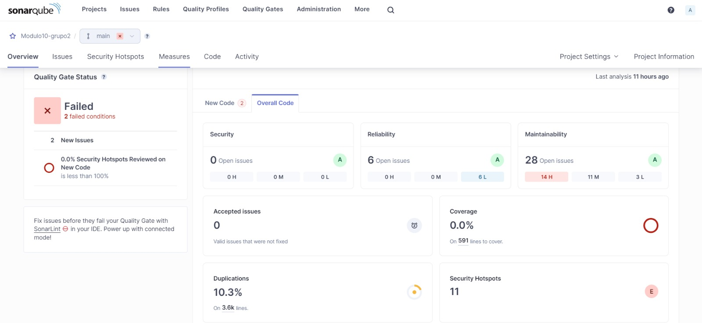
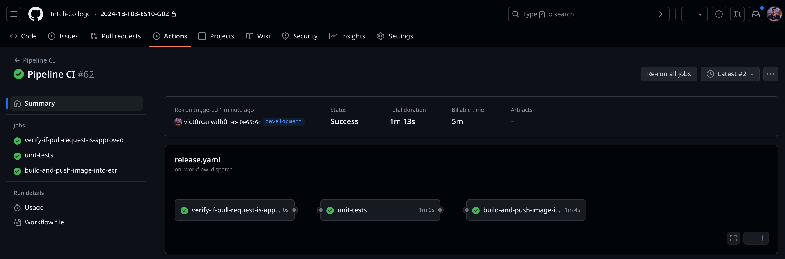
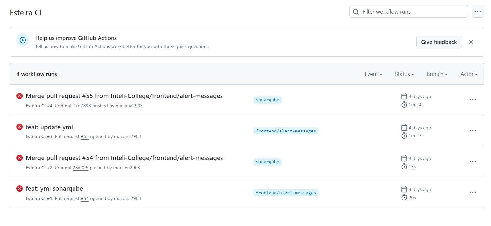
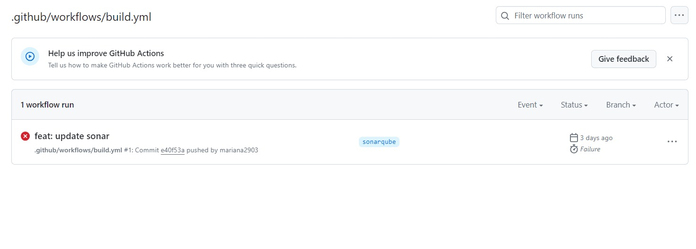
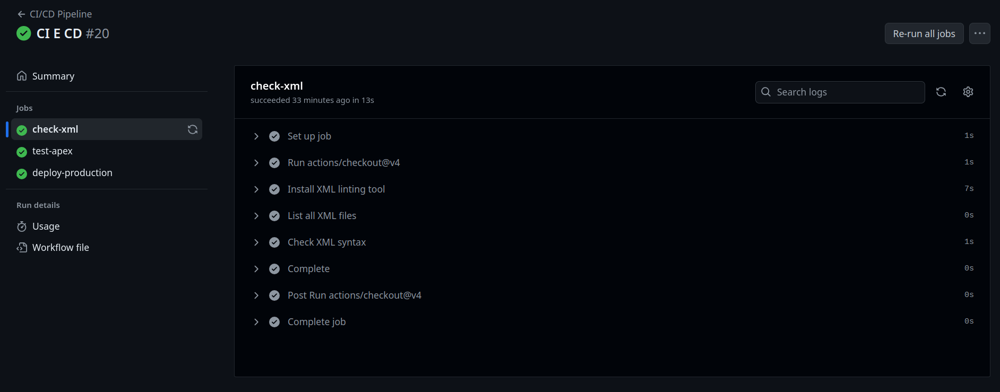
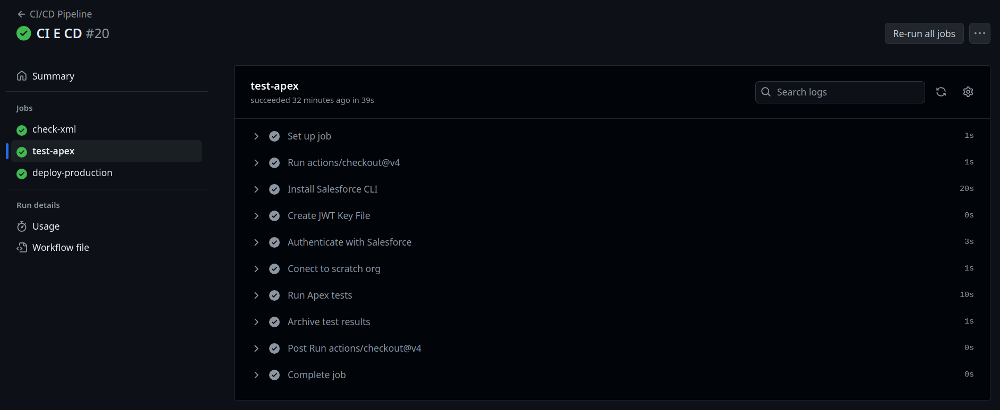

# Sumário

- [1. Esteira de CI - Deploy Buddy](#1-esteira-de-ci---deploy-buddy)
  - [1.1 Implementação de git flow](#11-implementação-de-git-flow)
  - [1.2 Revisão de código - pull request](#12-revisão-de-código---pull-request)
  - [1.3 Compilação da versão presente no commit](#13-compilação-da-versão-presente-no-commit)
  - [1.4 Configuração de análise estática de código](#14-configuração-de-análise-estática-de-código)
  - [1.5 Execução dos testes](#15-execução-dos-testes)
- [2. Esteira de CI - Repositório SF (SalesForce)](#2-esteira-de-ci---repositório-sf-salesforce)
- [3. Implementação Sonarqube](#3-implementação-sonarqube)

# 1. Esteira de CI - Deploy Buddy
A esteira de CI para os processos de deploy automatizado da aplicação que estamos desenvolvendo funciona da seguinte maneira: 
- Criamos um arquivo YAML para o GitHub Actions que tem como função realizar a compilação do código, a análise estática e a execução dos testes. Se algum desses processos falhar, a esteira é interrompida e o deploy não é realizado. De forma mais detalhada, a esteira de CI verifica o código que está em processo de deploy e, em caso de sucesso, realiza o build do nosso Dockerfile localizado no diretório do nosso backend. Este Dockerfile é responsável por construir o backend de nossa aplicação (desenvolvida em Go) e gerar uma imagem. Como etapa final, essa imagem é enviada para o nosso ECR (Elastic Container Registry), um serviço da AWS responsável pelo armazenamento e versionamento de imagens Docker.

### 1.1 Implementação de git flow
Para que a esteira de CI seja iniciada, é necessário que o repositório siga as convenções de nomes de branches e commits estabelecidos no arquivo de [gestão de configuração](../gestão-de-configuração). 
O gitflow deve ser respeitado, pois é necessário que haja um evento de aprovação de um Pull Request vindo da branch "development" para a branch "main". Logo, não são aceitas mudanças vindas diretamente de outras branches, a não ser que sejam branches de hot-fix.

```yml
- name: Verify if the pull request is in approved state
  if: github.event_name == 'pull_request' && github.event.review.state == 'approved'
  run: |
    if [[ ${{ github.event.review.state }} == 'approved' ]]; then
      echo "O pull request foi aprovado, executando os passos do job."
    fi
```

### 1.2 Revisão de código - pull request
Após a criação do Pull Request, é necessário que o PR seja aprovado por, pelo menos, duas pessoas, para que, dessa forma, seja realizado o merge com a main.

### 1.3 Compilação da versão presente no commit
O processo de CI foi configurado para compilar de forma automatizada a partir de mudanças efetuadas apenas na branch "main", não sendo aplicado a nenhuma outra branch do repositório. Logo, após ocorrer o evento de aprovações, os commits presentes no PR são aplicados à branch main, e o processo de CI continua. Dessa forma, é garantida uma integridade do código e um controle de versões seguro e íntegro.

```yml
- name: Verify if the pull request is sent by the development branch
  if: github.event_name == 'pull_request'
  run: |
    if [[ ${{ github.event.pull_request.base.ref }} == "development" ]]; then
      echo "Este PR vem da branch develop."
    else
      echo "Este PR não vem da branch develop."
      exit 1
    fi
```

### 1.4 Configuração de análise estática de código

#### Configuração Sonarqube

SonarQube é uma plataforma de análise de qualidade de código que proporciona uma visão detalhada da saúde do código-fonte, identificando automaticamente bugs, vulnerabilidades e outros problemas. Com uma interface de fácil uso, o SonarQube suporta várias linguagens de programação e se integra bem a diferentes ambientes de desenvolvimento, tornando-o uma ferramenta versátil para melhorar a qualidade e segurança do código.

Optar por hospedar o SonarQube em uma instância EC2 da AWS traz vantagens como alta disponibilidade, escalabilidade e flexibilidade. Isso permite que equipes acessem uma infraestrutura robusta e segura, gerenciem grandes volumes de dados e personalizem a análise de código para atender às necessidades específicas do projeto. Além disso, essa configuração facilita o acesso universal às métricas, ajudando todos os membros da equipe a monitorar e aprimorar continuamente o código.

#### 1.4.1 - Configuração da Instância EC2

1. Criação da Instância: Foi iniciada uma instância EC2 no console da AWS, escolhendo uma AMI apropriada e um tipo de instância que atenda às necessidades de recursos.
2. Configuração de Segurança: Configurar o grupo de segurança para permitir o tráfego na porta que o SonarQube utilizará (por exemplo, 9000 para acesso público).

#### 1.4.2 - Configuração do Docker e SonarQube na EC2

1. Instalar Docker na instância EC2.
    
    ```bash
    sudo apt update
    sudo apt install docker.io
    ```

2. Execução do SonarQube:
- Baixar e rodar o container do SonarQube:
            
   ```
   docker run -d --name sonarqube -p 9000:9000 sonarqube
   ```

- Comando para verificar se o container está rodando corretamente:
            
    ```
    docker ps
    ```
            

#### 1.4.3 - Conexão com o Projeto
        
   1. Integração com o Projeto:
      - Configurar o projeto para enviar análises para o SonarQube. Selecionando a linguagem e do ambiente de desenvolvimento.

   
#### 1.4.4 - Manutenção e Monitoramento
        
   1. Monitoramento do Container: Utilizar comandos do Docker para monitorar logs e performance do container do SonarQube.
      
       ```
       docker logs sonarqube
       ```

  

**Insights sprint 2**

- Status do Portão de Qualidade: Falhou
  - Condições falhadas: 2
  - Novos Problemas: 2
  - Pontos sensíveis de segurança em novo código revisados: 0.0% (o objetivo é 100%)
- Código Novo:
  - Segurança: Não há problemas abertos (Nota A)
  - Confiabilidade: 6 problemas abertos (Todos de baixa gravidade)
  - Manutenibilidade: 28 problemas abertos (14 altos, 11 médios, 3 baixos)
- Código Geral:
  - Segurança: Não há problemas abertos (Nota A)
  - Confiabilidade: Nota A com 6 problemas de baixa gravidade abertos
  - Manutenibilidade: Nota A com 28 problemas (14 altos, 11 médios, 3 baixos)
- Outras Métricas:
  - Cobertura: 0.0% em 591 linhas de código <br>
    - A cobertura de teste será coletada a partir da sprint 3, com o uso do coverage (arquivo responsável por armazenar a quantidade de código coberto por teste para leitura do Sonarqube).
  - Duplicações: 10.3% em 3.6k linhas
  - Pontos Sensíveis de Segurança: 11


### 1.5 Execução dos testes
A etapa de execução de testes é essencial para continuar a esteira de CI, caso os testes necessários não passem, a esteira é interrompida. Esse job envolve as etapas de checkout do repositório, setup do Golang e execução dos testes.

É importante ressaltar que é necessário ter o `.env`para a execução dos testes, que pode ser gerado por meio do comando `make env` no diretório /src/server e renomeado de `.env.example` para `.env`.

```yml
- name: Checkout Repo
  uses: actions/checkout@v2

- name: Setup Go
  uses: actions/setup-go@v2
  with:
    go-version: '1.22.2'

- name: Install dependencies and run tests
  run: |
    cd src/server && cp .env.example .env && go mod tidy && make database-dev
    cd internal/tests && go test
    cd ../.. && make clean
```

### 1.6. Build da imagem e push para o ECR
Este job constrói uma imagem Docker do código fonte e a envia para o Amazon Elastic Container Registry (ECR) e é executado após a conclusão dos testes unitários. Envolve as etapas de checkout, configuração das credenciais da AWS, login no ECR, determinação da TAG da imagem, deleção da imagem existente e o build e push da imagem para o ECR.

```yml
steps:
    - name: Checkout Repo
      uses: actions/checkout@v2

    - name: Configure AWS credentials
      uses: aws-actions/configure-aws-credentials@v1
      with:
        aws-access-key-id: ${{ secrets.AWS_ACCESS_KEY_ID }}
        aws-secret-access-key: ${{ secrets.AWS_SECRET_ACCESS_KEY }}
        aws-session-token: ${{ secrets.AWS_SESSION_TOKEN }}
        aws-region: ${{ secrets.AWS_DEFAULT_REGION }}
    
    - name: Login to Amazon ECR
      id: login-ecr
      uses: aws-actions/amazon-ecr-login@v1

    - name: Determine IMAGE_TAG
      id: set-tag
      run: |
        if [ "${{ github.event.inputs.action-type }}" == "release" ]; then
          echo "IMAGE_TAG=latest" >> $GITHUB_ENV
        elif [ "${{ github.event.inputs.action-type }}" == "rollback" ]; then
          echo "IMAGE_TAG=rollback" >> $GITHUB_ENV
        else
          echo "IMAGE_TAG=unknown" >> $GITHUB_ENV
        fi

    - name: Delete Existing Image
      run: |
        aws ecr batch-delete-image --repository-name builds --image-ids imageTag=$IMAGE_TAG || echo "No image found with tag $IMAGE_TAG, or deletion not required."

    - name: Verifies
      run: |
        echo "ECR_REGISTRY=${{ steps.login-ecr.outputs.registry }}"
        echo "IMAGE_TAG=$IMAGE_TAG"

    - name: Build the Docker image
      run: |
        docker build -t ${{ steps.login-ecr.outputs.registry }}/builds:$IMAGE_TAG -f src/server/Dockerfile src/server

    - name: Push the Docker image to Amazon ECR
      run: |
        docker push ${{ steps.login-ecr.outputs.registry }}/builds:$IMAGE_TAG

```

### Execução da Esteira de CI - Repositório Deploy Buddies

<p align="center">
    
</p>

A imagem acima representa o contexto de git flow indicado, já que somente ocorre em caso de aprovação de um Pull Request vindo da branch "development" para a branch "main". Além disso, ele conta com outras validações, como a da compilação da versão presente no commit, que no caso podem envolver diversos commits no Pull Request. Depois disso, os testes da aplicação são executados com a finalidade de verificar se houve algum erro nas principais funcionalidades da aplicação. Por fim, o build da imagem docker é criado e armazenado no ECR(Elastic Container Registry).

# 2. Implementação Sonarqube

E esteira de CI (Continuous Integration ou Integração Contínua) é uma prática de desenvolvimento de software que enfatiza a importância de testar e integrar alterações de código de forma regular e automatizada. E portanto, a inclusão do SonarQube como uma ferramenta de análise estática de código é de extrema importância, pois traz insights sobre a qualidade do código, além de identificar potenciais problemas antes que eles evoluam para falhas mais sérias.

O workflow no GitHub Actions, "Sonarqube Esteira CI" que está no arquivo build.yaml, dentro de workflows, exemplifica uma implementação robusta do SonarQube dentro de uma esteira de CI dentro do projeto. Sendo configurado para ser acionado manualmente, a cada push ou pull request para a branch development. O objetivo principal do workflow é garantir a qualidade do código através da construção, teste e análise estática do código, utilizando a ferramenta SonarQube.

### Função Geral do Workflow
O workflow realiza várias ações essenciais para a integração contínua como as listadas a seguir:

- Instalação das dependências necessárias: Garante que todas as dependências necessárias para o projeto sejam instaladas.
- Construção da aplicação: Compila o código do projeto para garantir que não há erros de compilação.
- Execução de testes unitários: Verifica se os testes especificados estão passando, o que ajuda a garantir que o código está funcionando conforme esperado.
- Análise estática de código com SonarQube: Verifica o código em busca de problemas de qualidade, como bugs, vulnerabilidades de segurança, e problemas de manutenibilidade.

Código do workflow e em seguida a explicação de cada parte

```
name: Sonarqube steira CI

on:
  workflow_dispatch:

jobs:
  build-and-analyze:
    runs-on: ubuntu-latest
    services:
      sonarqube:
        image: sonarqube
        ports:
          - 9000:9000
    steps:
      - uses: actions/checkout@v2
      - name: Setup Go
        uses: actions/setup-go@v2
        with:
          go-version: '1.22'
      - name: Install Dependencies
        run: go mod tidy
        working-directory: ./src/server
      - name: Build Application
        run: make build
        working-directory: ./src/server
      - name: Run Unit Tests
        run: go test -v ./...
        working-directory: ./src/server
      - name: Wait for SonarQube to be fully ready
        run: |
          echo "Waiting for SonarQube to fully start..."
          until [[ "$(curl -s 'http://localhost:9000/api/system/status' | jq -r .status)" == "UP" ]]; do
            echo "SonarQube is not ready yet..."
            sleep 10
          done
          echo "SonarQube is ready."
      - name: SonarQube Scan
        uses: sonarsource/sonarqube-scan-action@master
        with:
          projectBaseDir: ./src/server
          sonar.host.url: http://localhost:9000
          sonar.login: ${{ secrets.SONAR_TOKEN }}

```


Detalhamento das Partes do Workflow

**Trigger Events (on):**

workflow_dispatch: Permite que o workflow seja acionado manualmente.

build-and-analyze: Este é o único job definido e contém várias etapas para construir e analisar o código.

**Etapas do Job (steps):**

- Checkout Repository: Usa a ação actions/checkout@v2 para clonar o repositório Git atual no ambiente de execução do GitHub Actions.
- Setup Go: Configura o ambiente de execução com a versão especificada do Go (1.22), usando actions/setup-go@v2.
- Install Dependencies: Executa go mod tidy no diretório especificado (./src/server) para garantir que o arquivo go.mod esteja atualizado e limpo.
- Build Application: Constrói a aplicação usando o comando make build dentro do diretório ./src/server.
- Run Unit Tests: Executa testes unitários com go test -v ./..., o que verifica se todos os testes estão passando.
- Wait for SonarQube to be fully ready: Espera até que o serviço SonarQube esteja totalmente operacional
- SonarQube Scan: Essa etapa eealiza a análise estática do código com SonarQube, usando a ação sonarsource/sonarqube-scan-action@master configurada com o diretório base do projeto, a URL do host SonarQube e o token de login.

**Serviços (services):**

SonarQube: Define um serviço SonarQube que é iniciado antes das etapas do job. O SonarQube é disponibilizado na porta 9000, permitindo que a análise estática seja realizada localmente no ambiente de execução.





Ao decorrer da sprint 3 foi realizada toda a implementação do Sonarqube na esteira de CI, e as imagens demonstram os resultados, não obtivemos resultados de sucesso até o momento com o uso do sonarqube nesse processo da esteira de CI, mas como próximo passo da implementação é o correto funcionamento do workflow implementado.

E na sprint anterior o Sonarqube já havia sido implementado para a análise estática de código e portanto já estava rodando na AWS, com o processo que está descrição no item 1.4 dessa documentação. 


# 3. Esteira de CI - Repositório SF (SalesForce)

No caso do Salesforce, temos um processo um pouco diferente, considerando que lidamos com metadados que compõem a ORG do Salesforce. 

Atualmente, nossa aplicação, ao receber uma solicitação para subir mudanças, puxa os metadados da ORG especificada pelo usuário, cria um branch em nosso repositório de metadados e realiza o commit dos metadados (especificados pelo usuário) nesse branch. Para isso, configuramos uma esteira de CI que valida esses arquivos XML. Criamos um arquivo YAML para o GitHub Actions que tem como função validar os XMLs presentes na branch de metadados usando o xmlint. Em caso de sucesso, uma notificação é enviada aos responsáveis pelo Slack, informando que a validação foi bem-sucedida e que as modificações estão prontas para serem aplicadas na ORG do Salesforce.

A CI Pipeline implementada para o Salesforce foi projetada para garantir a integridade e a qualidade do código antes da integração em branches principais (prod), com uma ênfase especial na verificação de arquivos XML e na execução de testes Apex. Esta seção detalha cada componente da pipeline, destacando sua configuração e operação.

## Configuração Geral da Pipeline

A pipeline é acionada em várias situações relacionadas ao pull requests na branch `prod`, incluindo a abertura, sincronização, reabertura e fechamento de pull requests. Além disso, é possível acionar a pipeline manualmente usando o `workflow_dispatch`.

```yaml
name: CI/CD Pipeline

on:
  pull_request:
    branches:
      - prod
    types:
      - opened
      - synchronize
      - reopened
      - closed
  pull_request_review:
    types: [submitted]
  workflow_dispatch:
```

## Verificação de Arquivos XML

O primeiro passo da pipeline foca na validação da sintaxe de arquivos XML, essenciais para garantir que as configurações e metadados do Salesforce estejam corretos.

1. **Clonagem do Repositório**
    - Usa a ação `actions/checkout@v4` para clonar o repositório.

2. **Instalação do Ferramenta de Linting XML**
    - Instala o `libxml2-utils`, um conjunto de ferramentas para processar arquivos XML.

    ```yaml
    - name: Install XML linting tool
      run: sudo apt-get update && sudo apt-get install -y libxml2-utils
    ```

3. **Listagem de Arquivos XML**
    - Utiliza o comando `find` para listar todos os arquivos XML no repositório.

    ```yaml
    - name: List all XML files
      run: |
        find . -type f -name "*.xml"
    ```

4. **Verificação de Sintaxe XML**
    - Valida a sintaxe de cada arquivo XML usando o `xmllint`. Em caso de falha, é interrompido (`set -e`).

    ```yaml
    - name: Check XML syntax
      run: |
        set -e
        for file in $(find . -type f -name "*.xml"); do
          if xmllint --noout "$file" 2>/dev/null; then
            echo "XML syntax is valid for $file"
          else
            echo "XML syntax check failed for $file"
          fi
        done
    ```

5. **Conclusão da Verificação**
    - Informa que todos os arquivos XML foram verificados.

    ```yaml
    - name: Complete
      run: echo "All XML files have been checked."
    ```



## Execução de Testes Apex

A parte dos `test-apex` é executado após a conclusão bem-sucedida da checagem dos arquivos xml e se concentra na execução de testes Apex, utilizando a CLI do Salesforce. Os testes de unidade do Apex garantem alta qualidade para o código do Salesforce e permitem cumprir os requisitos para implantação.

1. **Clonagem do Repositório**
    - Novamente, usa a ação `actions/checkout@v4` para clonar o repositório.

2. **Instalação da CLI do Salesforce**
    - Instala a CLI do Salesforce globalmente via npm.

    ```yaml
    - name: Install Salesforce CLI
      run: npm install --global @salesforce/cli
    ```

3. **Criação do Arquivo de Chave JWT**
    - Cria um arquivo de chave JWT a partir da variável secret armazenada `SF_JWT_KEY`.

    ```yaml
    - name: Create JWT Key File
      run: echo "${{ secrets.SF_JWT_KEY }}" > jwt_key.pem
    ```

4. **Autenticação com o Salesforce**
    - Autentica no Salesforce usando o método JWT, utilizando as credenciais armazenadas como secrets no github (`SF_CLIENT_ID`, `SF_USERNAME`).

    ```yaml
    - name: Authenticate with Salesforce
      run: sfdx auth:jwt:grant --client-id ${{ secrets.SF_CLIENT_ID }} --jwt-key-file jwt_key.pem --username ${{ secrets.SF_USERNAME }} --instance-url https://login.salesforce.com -a SalesforceHay
    ```

5. **Conexão com a Org Scratch**
    - Define a org padrão para execução dos comandos.

    ```yaml
    - name: Conect to scratch org
      run: sfdx force:config:set defaultusername=SalesforceHay
    ```

6. **Execução dos Testes Apex**
    - Executa todos os testes locais Apex e gera um relatório em formato JUnit.

    ```yaml
    - name: Run Apex tests
      run: sf apex run test -l RunLocalTests -c -r junit -w 90 -d test-results
    ```

7. **Arquivamento dos Resultados dos Testes**
    - Usa a ação `actions/upload-artifact@v3` para armazenar os resultados dos testes.

    ```yaml
    - name: Archive test results
      uses: actions/upload-artifact@v3
      with:
        name: test-results
        path: test-results
    ```

